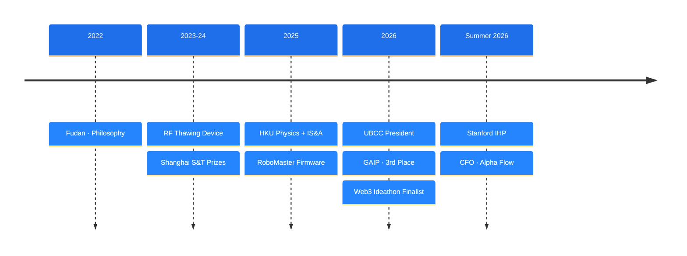

<h1 align="center">Yinan Gordon LIU</h1>

  

  HKU Physics + BBA(IS&A) '29 &nbsp;·&nbsp; Stanford IHP '26

  
  
  

---

> *I like carrying one idea all the way: from first principles, to a working prototype, to a number on a spreadsheet.*

I'm a double-degree student in **Physics** and **Information Systems & Analytics** at the University of Hong Kong, with summer coursework at **Stanford** in computer science and technology entrepreneurship.

My work sits between **hardware, code and business**: I've written STM32 firmware for a robotics team, built an RF power-amplification prototype, and now run financial planning for an early-stage AI-for-quant startup.

---

## How I Got Here

---

## Focus Areas

<table>
  <tr>
    <td align="center" width="33%">
      <b>⚙️ Embedded Systems</b> 
      STM32 · FreeRTOS · CAN / USART Cascaded PID control
    </td>
    <td align="center" width="33%">
      <b>📡 Hardware Prototyping</b> 
      40.68 MHz RF amplification Sensing · adaptive power control
    </td>
    <td align="center" width="33%">
      <b>📈 Startup Finance</b> 
      Financial planning · cost modelling AI-driven quant infrastructure
    </td>
  </tr>
  <tr>
    <td align="center">
      <b>🧭 Consulting</b> 
      Market & competitive research Digital transformation
    </td>
    <td align="center">
      <b>🛡️ Insurance Innovation</b> 
      Actuarial pricing models Auto-payout mechanism design
    </td>
    <td align="center">
      <b>🐍 Data & Analytics</b> 
      Python · MATLAB Advanced Excel modelling
    </td>
  </tr>
</table>

---

## Experience

**Chief Financial Officer — Alpha Flow** &nbsp;·&nbsp; *Stanford, CA · Jul 2026 – Present*
- Lead financial planning for an early-stage startup building world-model training infrastructure for AI-driven quantitative trading.
- Priced the tech stack module by module (solver, operator algebra, controller, visualization) to find where development spend actually goes.

**President — University Business Consulting Club, HKU** &nbsp;·&nbsp; *Hong Kong · Apr 2026 – Present*
- Designed a Notion-based knowledge management system, cutting admin turnaround by ~30%.
- Co-hosted networking events with the HKU Investment Banking Club for 300+ students; ran a 5-day orientation camp for 140+ participants.

**Embedded Software Engineer — HKU RoboMaster Team** &nbsp;·&nbsp; *Hong Kong · Oct 2025 – May 2026*
- C/C++ firmware on STM32 for the robotic dart-launcher subsystem (FreeRTOS, CAN, USART).
- Tuned cascaded position-velocity PID loops for DJI motors; owned the subsystem from architecture to on-field debugging.

---

## Projects

### 📡 Intelligent Food Thawing Device — RF Power Amplification
*Independent project · Feb 2023 – Dec 2024*

A prototype integrating a 40.68 MHz RF power amplification system, real-time temperature/humidity sensing, adaptive power control and app-based remote scheduling — benchmarked against conventional thawing for speed and uniformity.

🏆 Second Prize, 2024 "Future Cup" Shanghai S&T Innovation Competition · Third Prize, 39th Shanghai Youth S&T Innovation Competition

### 📊 [Apple Stock Trading Simulator](https://github.com/Gordonlyn/LGYNN)
*Python · yfinance*

A text-based trading game that replays one year of real AAPL prices so you can practise buy / sell / hold decisions with a simulated portfolio.

---

## Honors & Case Competitions

| | |
|---|---|
| 🥉 **3rd Place** — GAIP Insurance Innovation Competition 2026 (HK Final) | Built the actuarial pricing model and app prototype for an eVTOL air-rescue insurance product |
| 🏅 **Finalist & Honorable Mention** — Hong Kong Web3 Ideathon 2026 | Led the post-fraud recovery pipeline: insurance pool + auto-payout mechanism |
| 🎯 **Competitor** — 2026 Bain Cup · HSBC asset-allocation case competition | |
| 🎓 **HKU Global Short-term Programme** financial assistance (HKD 14,000) | Stanford IHP, Summer 2026 |

---

## Tech Stack

  
  
  
  
  
  
  
  

**Languages:** Mandarin (native) · English (full professional) · Cantonese (conversational)
**Also:** HKU Mandarin Debate Team — Shanghai Cup, Yunyou Debate Competition

---

  

